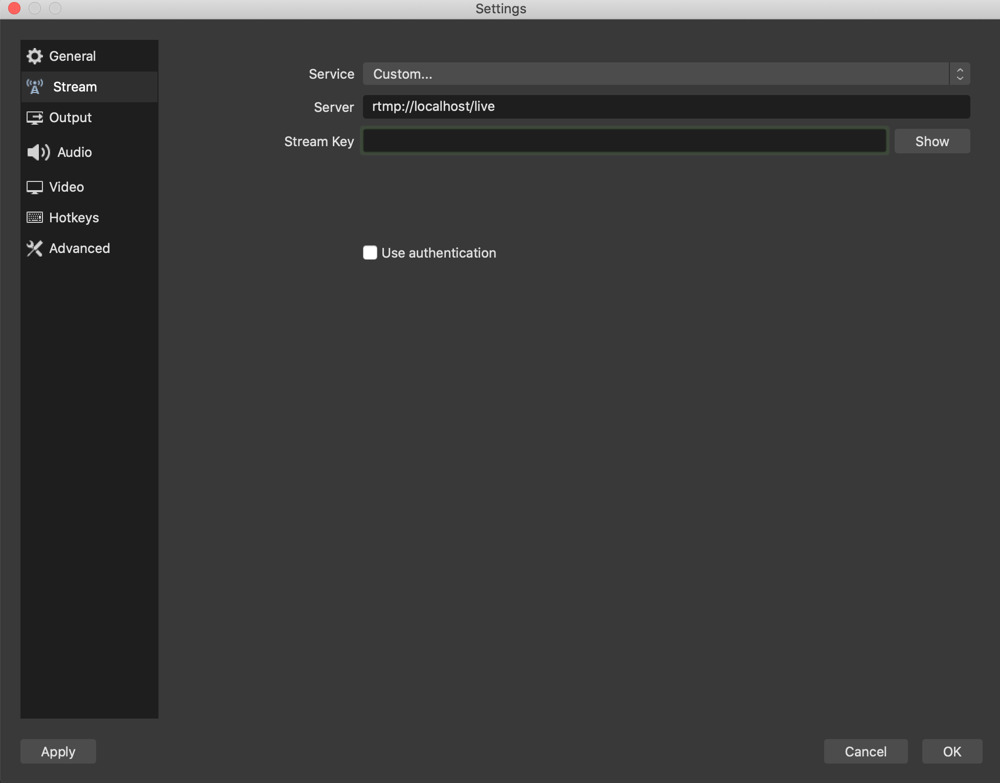
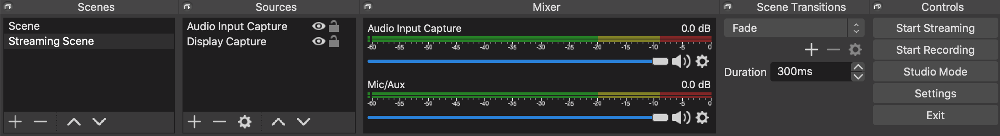

# streamy-app
This is a streamy web application, which allows user to sign in with Google, create a stream, edit a stream, delete a stream, watch a stream.
<br/>


## How to run the application

Clone the repo and open index.html in a web browser
```
git clone https://github.com/johnnysea/streamy-app.git
```

Under folder "streams", execute following code in each subfolder ("api", "client", "rtmpserver")
```
npm install
npm start
```

Download OBS from "https://obsproject.com/" which is a free and open source software for video recording and live streaming

In the settings of OBS, choose Service as "Custom", Server as "rtmp://localhost/live", Stream Key as the key number of the stream you created on the web application



On OBS UI, create a stream and enbale "Audio Input Capture" and "Display Capture", and hit "Start Streaming", then you can see your stream on the webpage

<br/>


## Authors

Johnny Shao